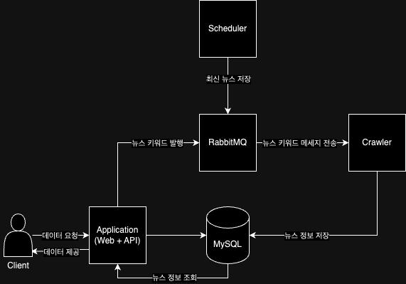

# 뉴스 수집 서비스

## Spec
- Spring Boot 3.2.2
- Java 17
- JPA
- MySQL
- RabbitMQ

## 서버 구성도

## 보완할점
- 테스트 코드
- 페이지 UI
- docker-compose를 이용한 일괄 실행
  - 실행 시 필요한 미들웨어(RabbitMQ, MySQL) 실행
- Exception 처리
- domain 모듈 분리(모듈 전부에 의존시키지 않고 application에만 의존시켜야함)
  - crawler, scheduler는 domain모듈을 의존 받지 않고 직접 DB와 연동하여 필요한 Entity만 사용하도록 해야함